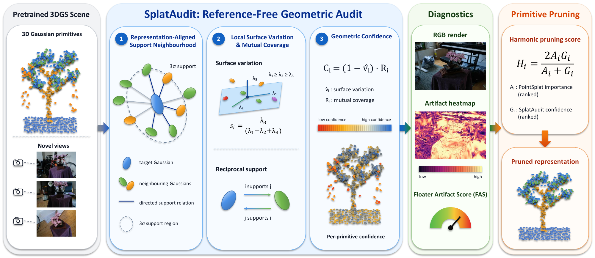

<div align="center">

<h1>SplatAudit: Reference-Free Geometric Auditing of Floater Artifacts in 3D Gaussian Splatting</h1>

<p>Ian Wai Si<sup>1</sup> &nbsp;·&nbsp; Elaine Huang<sup>2</sup></p>
<p><sup>1</sup>Tsinghua University &nbsp;&nbsp; <sup>2</sup>Mission San Jose High School</p>
<p><strong>KDD 2026 Undergraduate Consortium</strong></p>

<a href="https://kdd2026.kdd.org/wp-content/uploads/2026/09/14-SplatAudit-Reference-Free-Geometric-Auditing-of-Floater-Artifacts-in-3D-Gaussian-Splatting.pdf">Paper</a> &nbsp;|&nbsp;
<a href="https://kdd2026.kdd.org/undergraduate-consortium-2/">KDD 2026</a> &nbsp;|&nbsp;
<a href="#installation">Installation</a> &nbsp;|&nbsp;
<a href="#usage">Usage</a> &nbsp;|&nbsp;
<a href="#citation">Citation</a>

</div>

Official implementation of **SplatAudit**, a reference-free framework for
auditing floater artifacts in trained 3D Gaussian Splatting (3DGS) scenes.

<!-- Figure source: ../SplatAudit-Paper/figures/pipeline/splataudit_pipeline_short.pdf -->


## Overview

SplatAudit assesses the geometric coherence of pretrained 3DGS scenes without
ground-truth geometry or retraining. It combines **surface variation** and
**mutual coverage** over anisotropic 3σ support neighborhoods to produce:

- **Per-Gaussian confidence** for inspecting the learned representation.
- **Artifact heatmaps and Floater Artifact Score (FAS)** for view-dependent
  diagnostics. Lower FAS indicates less geometric artifact evidence.
- **One-pass pruning**, using geometric confidence alone or a harmonic
  combination with PointSplat importance, followed by refinement.

On seven Mip-NeRF 360 scenes with 24 training views, SplatAudit achieves the
lowest FAS in every scene at 20% retention. The hybrid improves mean image
quality over geometry alone at both 20% and 10% retention. See the paper
for full results and ablations.

## Installation

Requires Conda, an NVIDIA GPU, a compatible driver, and the CUDA 11.8 toolkit
(including `nvcc`). The environment provides Python 3.10 and PyTorch 2.4.1.

```bash
git clone --recursive https://github.com/Gearoid522/SplatAudit.git
cd SplatAudit
conda env create -f environment.yml
conda activate splataudit
python -m pip install --no-build-isolation -e . third_party/gaussian-splatting/submodules/{diff-gaussian-rasterization,simple-knn,fused-ssim}
```

Conda packages use the Tsinghua TUNA mirror; PyTorch uses the official CUDA
11.8 wheel index. CUDA is required for model loading, including CPU geometry
mode. If building for another GPU, set `TORCH_CUDA_ARCH_LIST` accordingly.

## Usage

### Audit a pretrained model

For an existing Graphdeco-format 3DGS model, export geometric confidence:

```bash
python cli/score.py \
  --scene /path/to/model \
  --method splataudit \
  --output /path/to/audit/splataudit_scores.npy \
  --geometry-device auto
```

`--scene` accepts a model directory (using its latest saved iteration) or a
Graphdeco-format Gaussian PLY. The output contains one confidence value in
`[0, 1]` per Gaussian, in PLY order; higher means stronger geometric support.
Use `--method hybrid` to export the combined pruning score instead.

### Train, prune, and evaluate

Prepare a [Mip-NeRF 360](https://jonbarron.info/mipnerf360/) or COLMAP scene
containing `images/` and `sparse/0/`. Keep datasets and outputs outside the
repository. The example below retains 20% of the baseline Gaussians.

```bash
# Train a sparse-24 baseline.
python cli/train.py \
  --scene-path /path/to/mipnerf360/bicycle \
  --seed 0 \
  --output /path/to/outputs/bicycle/baseline \
  --iterations 30000

# Prune once and refine without densification.
python cli/refine.py \
  --scene-path /path/to/outputs/bicycle/baseline \
  --train-path /path/to/mipnerf360/bicycle \
  --method splataudit \
  --keep 0.20 \
  --seed 0 \
  --output /path/to/outputs/bicycle/splataudit_20 \
  --iterations 5000

# Evaluate held-out views and save artifact heatmaps.
python cli/evaluate.py \
  --scene-path /path/to/outputs/bicycle/splataudit_20 \
  --source-path /path/to/mipnerf360/bicycle \
  --output /path/to/outputs/bicycle/splataudit_20/eval \
  --save-images
```

Training holds out every eighth camera and selects 24 evenly spaced training
views; use `--regime full` for all remaining views. For hybrid pruning, change
`--method splataudit` to `--method hybrid`. The paper's 10% setting uses
`--keep 0.10 --iterations 10000`.

Refinement and evaluation use the `view_split.json` created during training.
Evaluation saves PSNR, SSIM, LPIPS, and FAS in `results.json`, confidence in
`scores.npy`, and optional images in `renders/` and `fas/`.

The evaluation CLI normalizes FAS using the evaluated model's own alpha and
foreground mask. The paper's cross-method FAS comparison uses the unpruned
baseline's alpha and foreground reference.

## Citation

If you use SplatAudit in your research, please cite the paper:

```bibtex
@misc{si2026splataudit,
  title  = {{SplatAudit}: Reference-Free Geometric Auditing of Floater Artifacts in {3D} Gaussian Splatting},
  author = {Si, Ian Wai and Huang, Elaine},
  year   = {2026},
  note   = {Accepted to the KDD 2026 Undergraduate Consortium},
  url    = {https://kdd2026.kdd.org/wp-content/uploads/2026/09/14-SplatAudit-Reference-Free-Geometric-Auditing-of-Floater-Artifacts-in-3D-Gaussian-Splatting.pdf}
}
```

## Acknowledgements

Built on [3D Gaussian Splatting](https://github.com/graphdeco-inria/gaussian-splatting).
The hybrid score uses [PointSplat](https://arxiv.org/abs/2604.09903) intrinsic
importance. We evaluate on [Mip-NeRF 360](https://jonbarron.info/mipnerf360/).
